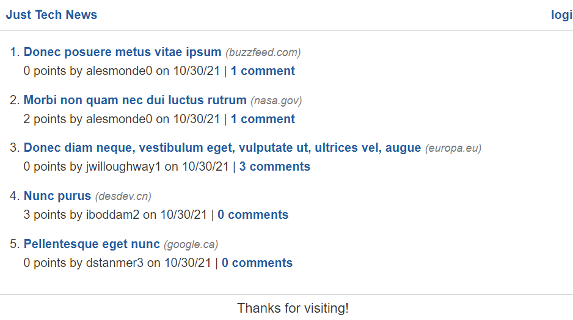

<br>
<p align="center">
   <h2 align="center">Tech Newsfeed</h2>
</p>
<br>

## About the project

This is an application that allows the user to create tech news posts and link those posts to articles. Users can upvote other posts and comment on posts.

### How to view project

To view this project, simply go to https://python-newsfeed-zd.herokuapp.com/dashboard to view the finished product.

To see the code for the site:

-   Clone the repo

    ```sh
    git clone git@github.com:Zd092718/python-newsfeed.git
    ```

### Built With

-   MySQL
-   Flask
-   Python
-   Node.js

### Preview Image



## Contact

Zachary Dowd - zacharyd2796@zohomail.com

Project Link - https://github.com/Zd092718/python-newsfeed
